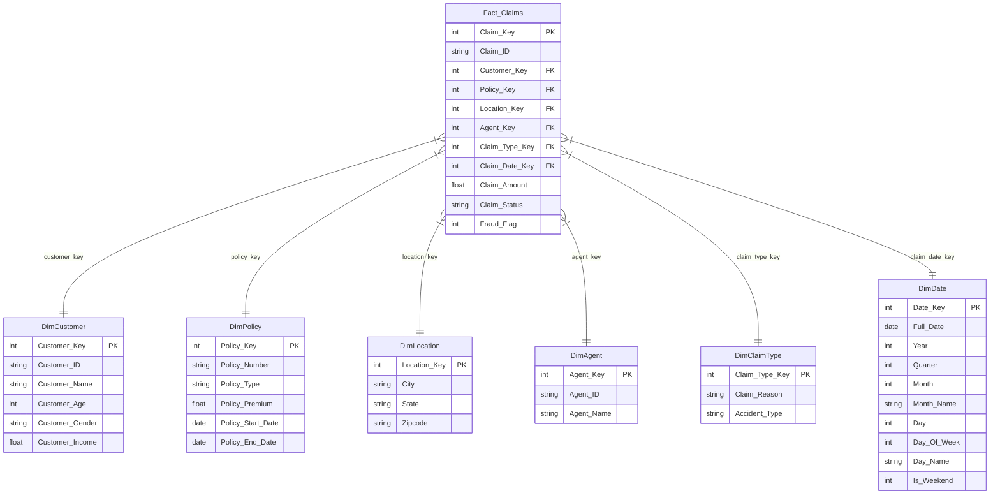

# Star Schema Design & ER Diagram

This document details the Star Schema designed for the **Fraud Detection and Claims Risk Assessment** project. The design transitions the flat, denormalized insurance records into an optimized analytical model.

## ER Diagram (Mermaid)

## Schema Relationships and Explanations

The schema uses a central **Fact_Claims** table surrounded by six dimension tables (a classic Star Schema configuration). This structure reduces redundancy, simplifies query writing, and improves execution performance in relational databases and Power BI.

### 1. Central Fact Table: `Fact_Claims`
- **Description**: Stores individual insurance claims, which are the main transactional events being analyzed.
- **Foreign Keys**: Links to all dimension tables via surrogate integer keys (`Customer_Key`, `Policy_Key`, `Location_Key`, `Agent_Key`, `Claim_Type_Key`, `Claim_Date_Key`).
- **Measures**:
  - `Claim_Amount`: The monetary value claimed by the policyholder (used for risk and loss analysis).
  - `Fraud_Flag`: Binary indicator (0 or 1) representing whether a claim is fraudulent.
- **Attributes**: `Claim_Status` (e.g. Approved, Rejected, Pending) is kept as a degenerate dimension or status flag directly in the fact table.

### 2. Dimension Tables
- **`DimCustomer`**: Contains demographic details of the policyholder. Allows slicing claim behaviors by age groups, income brackets, and gender.
- **`DimPolicy`**: Holds policy-specific terms including `Policy_Number`, `Policy_Type` (Auto, Home, Health, Life), and `Policy_Premium`. Enables calculating loss ratios (Claims / Premiums) per product.
- **`DimLocation`**: Captures geographic metrics based on City, State, and Zipcode. Useful for identifying high-risk states or hot spots for fraud.
- **`DimAgent`**: Identifies agents writing the policies. Helps detect internal fraud or agent-specific risk trends.
- **`DimClaimType`**: Groups claims by the cause/reason (e.g., Collision, Theft, Water Damage) and accident dynamics (`Accident_Type`).
- **`DimDate`**: An analytical date table generated from `Claim_Date`. It maps date values to components like Year, Quarter, Month, Day, and Weekend flag to enable time-series slicing and cohort alignment.
