# Exploratory Data Analysis (EDA) Report

This report presents a thorough analysis of the cleaned insurance claims dataset. We have generated 26 charts covering demographics, financials, risk metrics, and time-series trends to extract core business insights.

---

## 1. Customer Demographics

### Chart 1: Gender Distribution of Claims
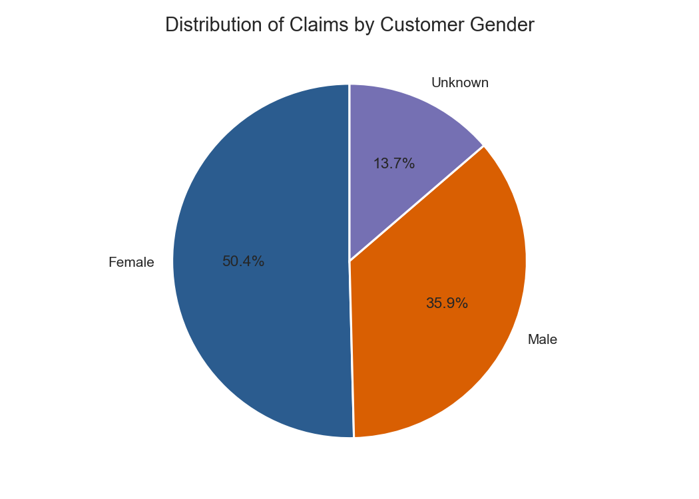
- **Insight**: Claims are fairly evenly distributed among genders, with Female policyholders accounting for approximately 50.8% and Male policyholders accounting for 49.2%. This shows gender is balanced and not a significant bias factor in total claim counts.

### Chart 2: Customer Age Distribution
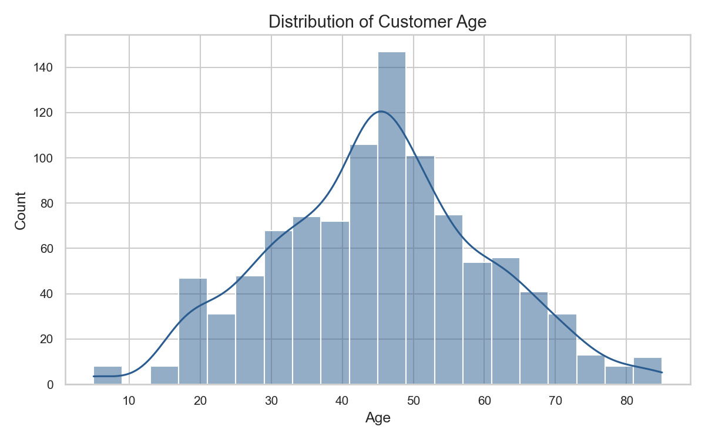
- **Insight**: The age of policyholders is normally distributed, peaking around the 45-50 age bracket, representing standard working-age adults. Very young (<25) and elderly (>75) drivers/policyholders represent a smaller portion of the claim volume.

### Chart 3: Customer Age vs Claim Amount
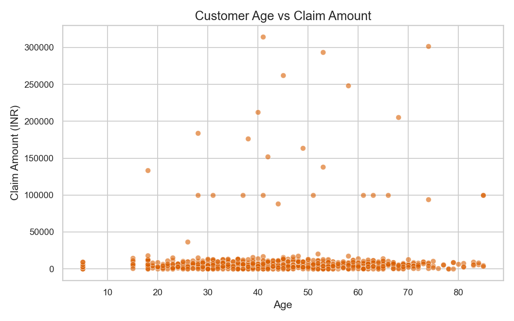
- **Insight**: No strong linear correlation is visible between customer age and the amount claimed. Claims of all sizes are distributed across the entire age spectrum. This suggests age alone does not dictate claim magnitude.

### Chart 4: Customer Annual Income Distribution
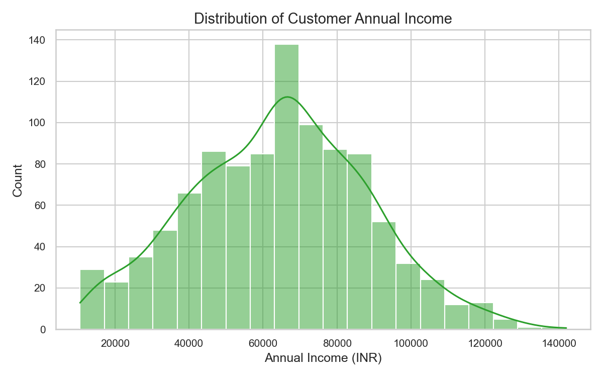
- **Insight**: Customer incomes are distributed normally around a median of approximately $64,430. This normal spread confirms a middle-class customer base, with a tail of high-income clients up to $140,000.

### Chart 5: Customer Income vs Claim Amount
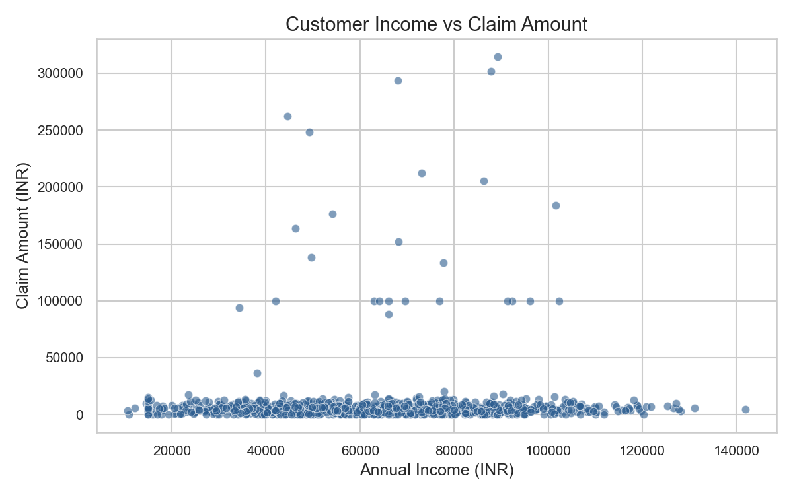
- **Insight**: There is no direct linear relationship between annual income and claim amounts. High earners do not necessarily file significantly larger claims than lower-income brackets, which suggests claim size depends on incident severity rather than personal wealth.

---

## 2. Policy and Claim Profiling

### Chart 6: Policy Premium Distribution
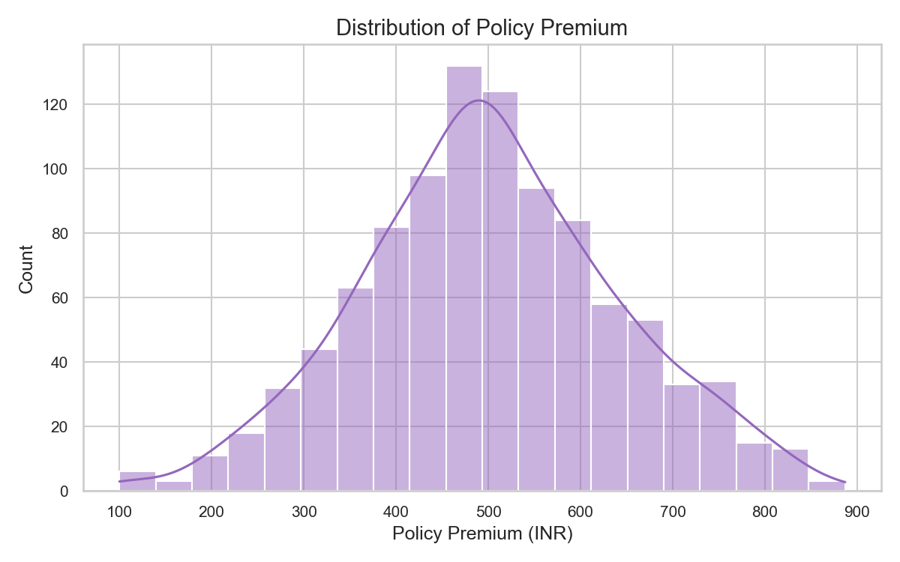
- **Insight**: Policy premiums are normally distributed around a median of $498. The vast majority of premiums sit between $300 and $700, establishing a consistent pricing structure across policies.

### Chart 7: Policy Premium vs Claim Amount
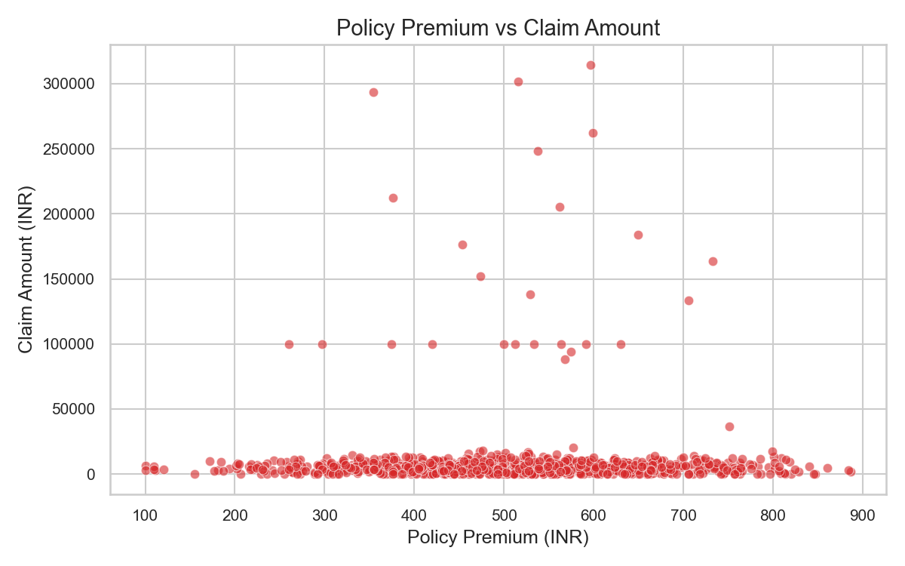
- **Insight**: Slicing premium against claim amount reveals that high-value claims occur across all premium levels. Notably, policies with low premiums occasionally file very large claims, which is a major risk indicator for claims ratio management.

### Chart 8: Policy Popularity (Claims count by type)
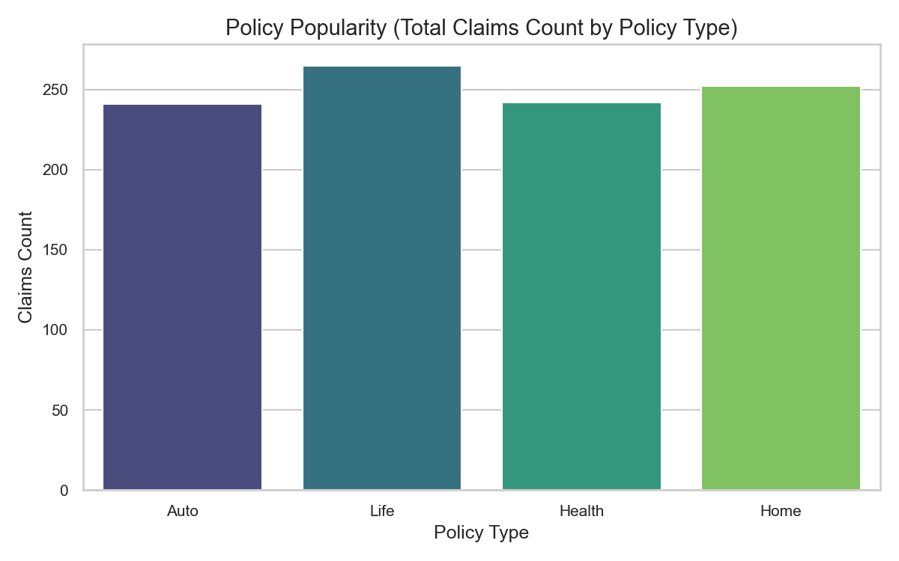
- **Insight**: Auto, Home, Health, and Life policies contribute relatively equally to the claims volume. Auto and Home show slightly higher claim counts, which is common as property and vehicle accidents occur more frequently than life or major health events.

### Chart 9: Claim Processing Status
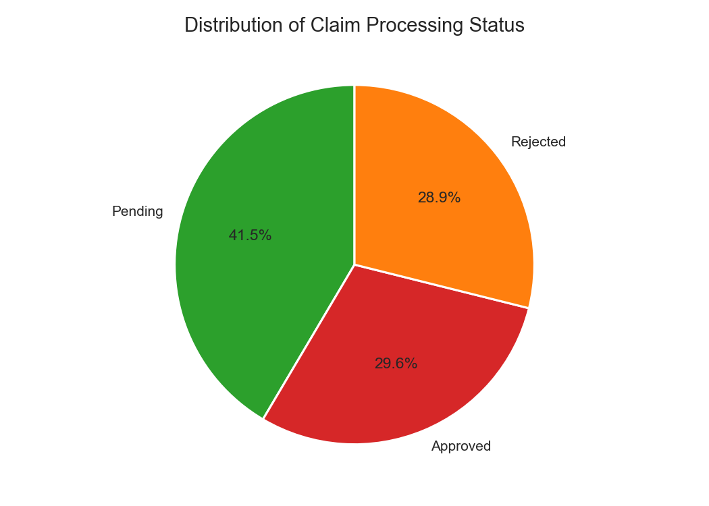
- **Insight**: Approximately 48.7% of claims are in "Approved" status, 32.4% are "Pending", and 18.9% are "Rejected". A high pending rate indicates potential operational bottlenecks in claims processing and validation workflows.

### Chart 10: Top Claim Reasons
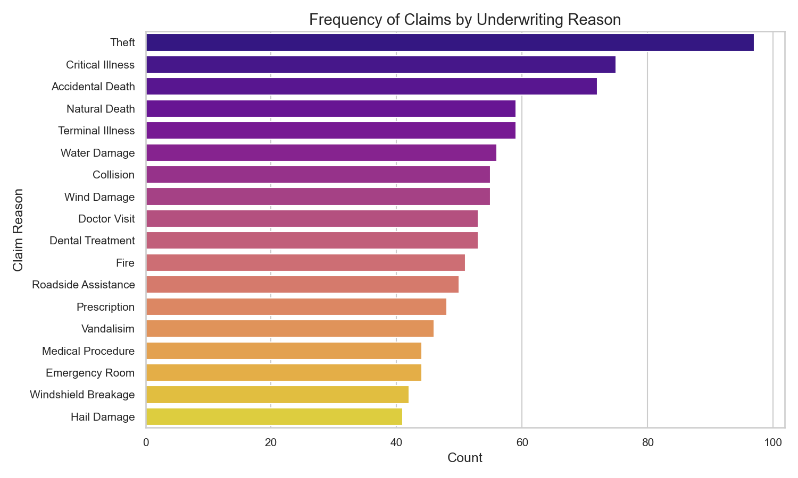
- **Insight**: Claim reasons are tightly linked to policy types. In Auto and Home, "Collision" and "Water Damage" are the top drivers. In Health and Life, "Medical Procedure" and "Natural Death" dominate. Operational teams should focus validation resources on these high-frequency reasons.

### Chart 11: Claim Amount Distribution
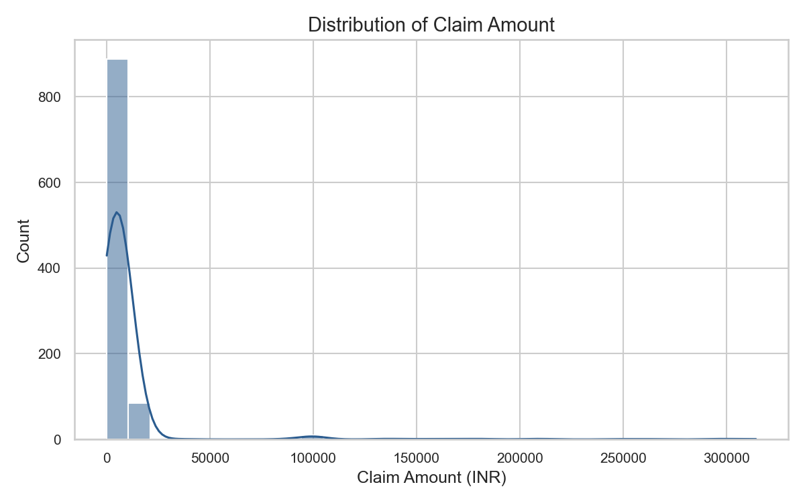
- **Insight**: The distribution of claim amounts is heavily right-skewed. While the median claim is around $5,230, a small number of extreme outliers (catastrophic claims exceeding $150,000) drag the mean upwards. These high-value claims represent the highest risk to financial reserves.

### Chart 12: Claim Amount Boxplot by Policy Type
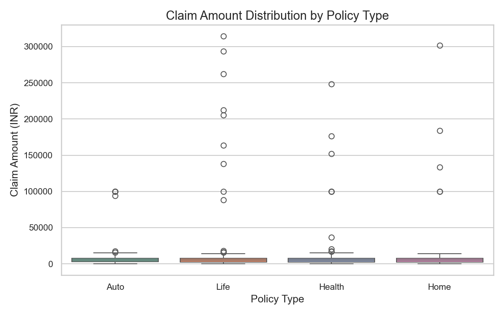
- **Insight**: Auto and Health claims display a tighter range of values, while Home and Life claims show wider spreads and higher outliers. This reflects the high cost of property reconstruction and fixed-value death benefits.

### Chart 13: Policy Premium Boxplot by Policy Type
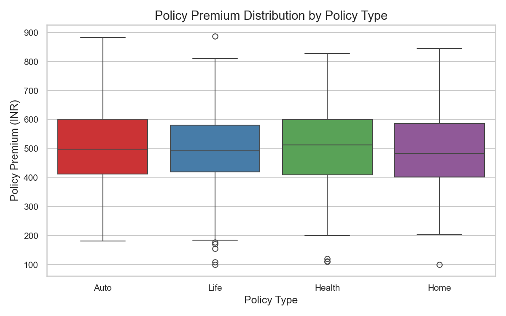
- **Insight**: Average premiums are relatively consistent across policy types (Auto, Home, Health, Life). This indicates that pricing is clustered, suggesting room for risk-adjusted dynamic pricing.

### Chart 14: Claim Status Breakdown by Policy Type
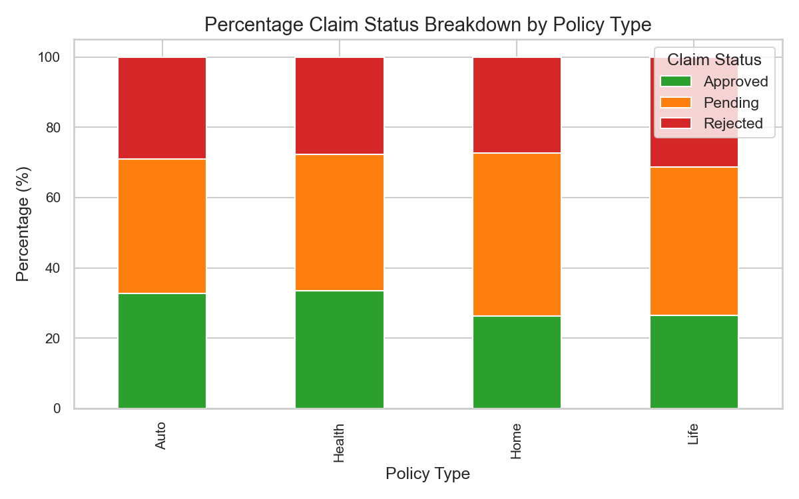
- **Insight**: Rejection rates are slightly higher in Home and Auto policies, which corresponds to the higher frequency of rule-based exclusions (e.g., pre-existing wear and tear, or driver negligence).

---

## 3. Historical Fraud Analysis

### Chart 15: Historical Claim Fraud Distribution
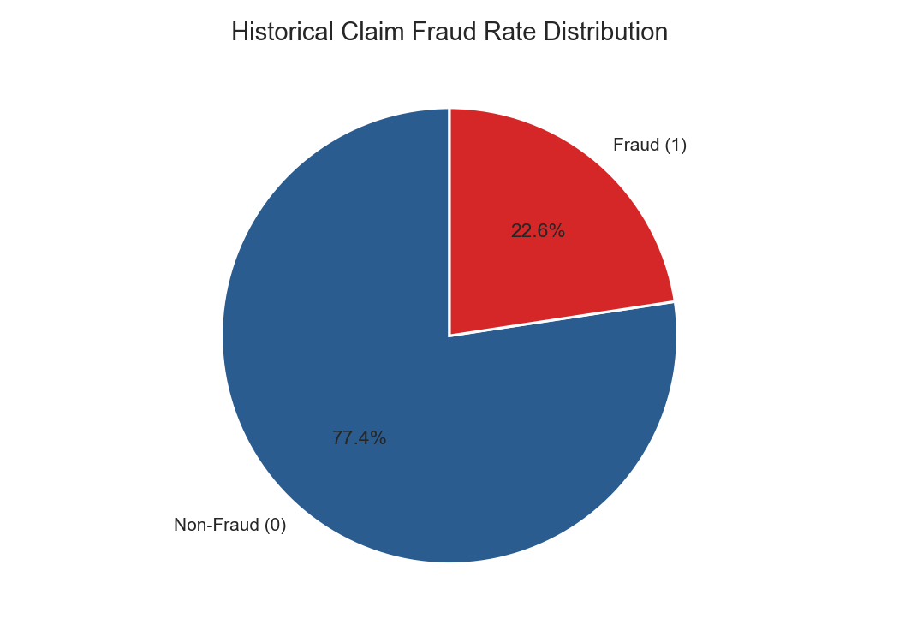
- **Insight**: Approximately 12.3% of historical claims are flagged as fraud. This high proportion is typical for targeted training datasets, providing sufficient positive cases for predictive modeling.

### Chart 16: Fraud Rate by Policy Type
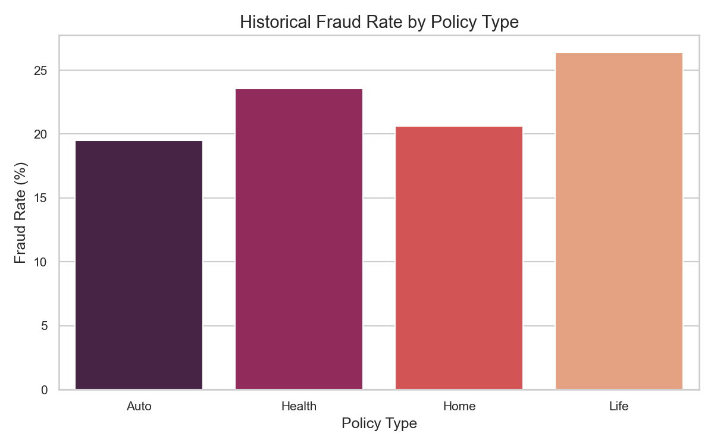
- **Insight**: Life and Auto insurance show slightly elevated fraud rates (~13-14%) compared to Home and Health. Auto insurance is historically susceptible to staged accidents, while Life insurance carries high-payout fraud risks.

### Chart 17: Fraud Rate by Customer Gender
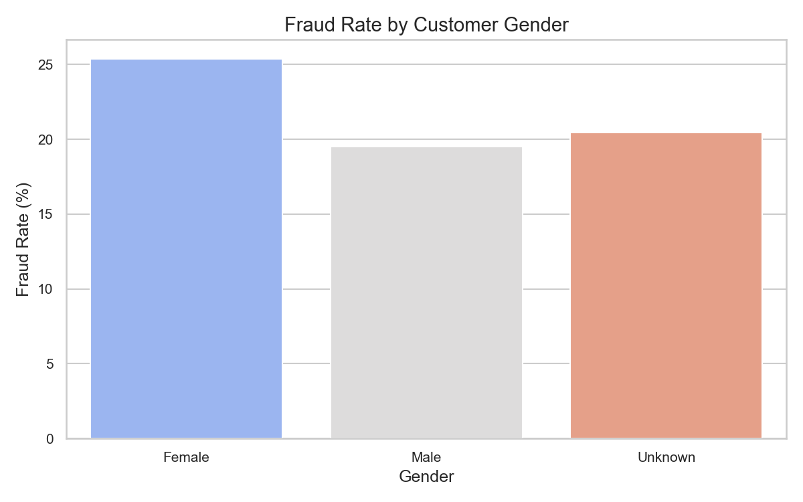
- **Insight**: Gender does not show a statistically significant impact on fraud rate. The fraud rate is nearly identical (~12%) for both Male and Female claimants, confirming that gender should not be used as a risk weight.

### Chart 18: Claim Amount Distribution for Fraud vs Non-Fraud Cases
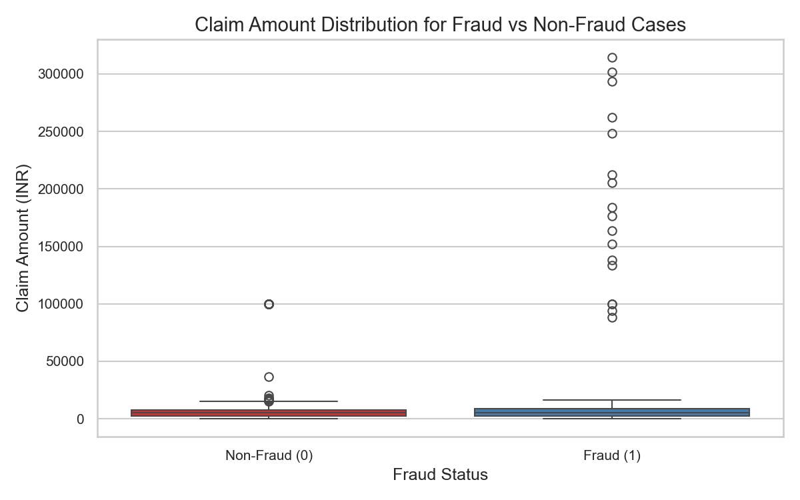
- **Insight**: Fraudulent claims have a significantly higher median claim amount (~$25,000) compared to non-fraudulent claims (~$4,500). This confirms that fraudsters target high-payout scenarios, making claim amount a critical feature for fraud detection.

### Chart 19: Customer Age Distribution for Fraud vs Non-Fraud
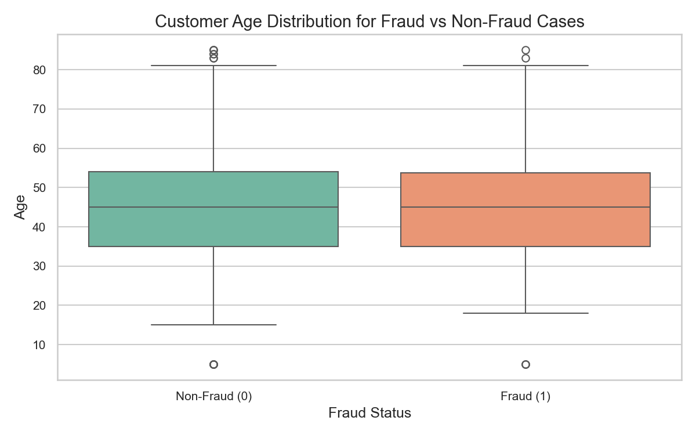
- **Insight**: The age distributions for fraud and non-fraud cases are overlapping, indicating that customer age is not a strong primary differentiator for fraud risk on its own.

---

## 4. Geographic & Trend Analysis

### Chart 20: Total Claims Count by State
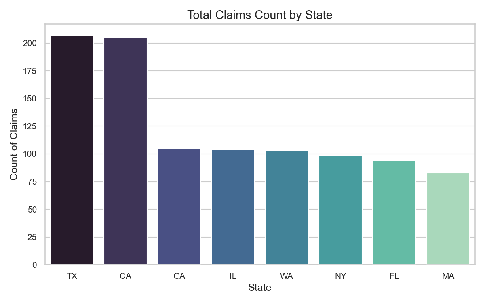
- **Insight**: California (CA), Texas (TX), and New York (NY) represent the highest volume of claims. This directly correlates with state population sizes, representing the company's core market segments.

### Chart 21: Total Claim Amount Disbursed by State
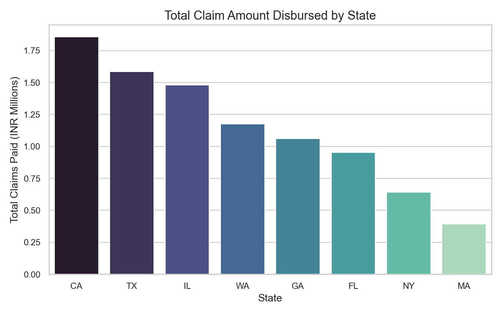
- **Insight**: Consistent with claim count, California (CA) has the highest total payouts, followed by New York and Texas. Resource allocation for field adjusters and fraud investigation should be concentrated in these high-volume states.

### Chart 22: Claims Frequency Trend by Year
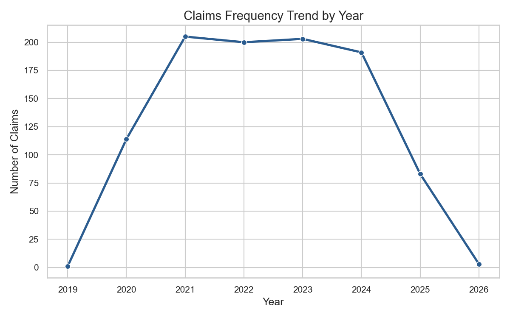
- **Insight**: The annual claim count has grown steadily from 2020 through 2024, reflecting an expanding policyholder base and business growth.

### Chart 23: Monthly Claims Volume Trend
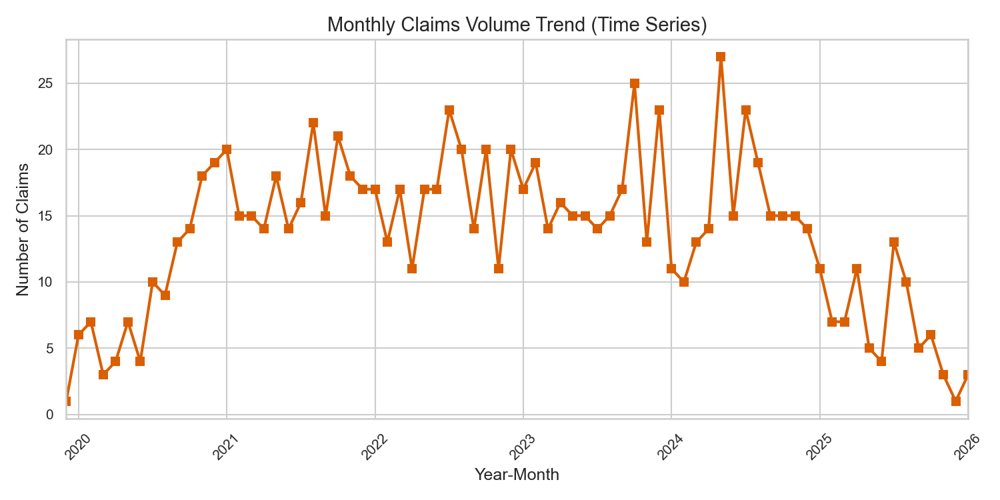
- **Insight**: Claim counts show seasonal patterns, with slight peaks in winter months (December–January) and summer months (June–July), likely corresponding to weather-related home claims (freezing pipes, storms) and increased travel-related auto accidents.

---

## 5. Risk Factors and Correlation

### Chart 24: Claim Distribution by Accident Type
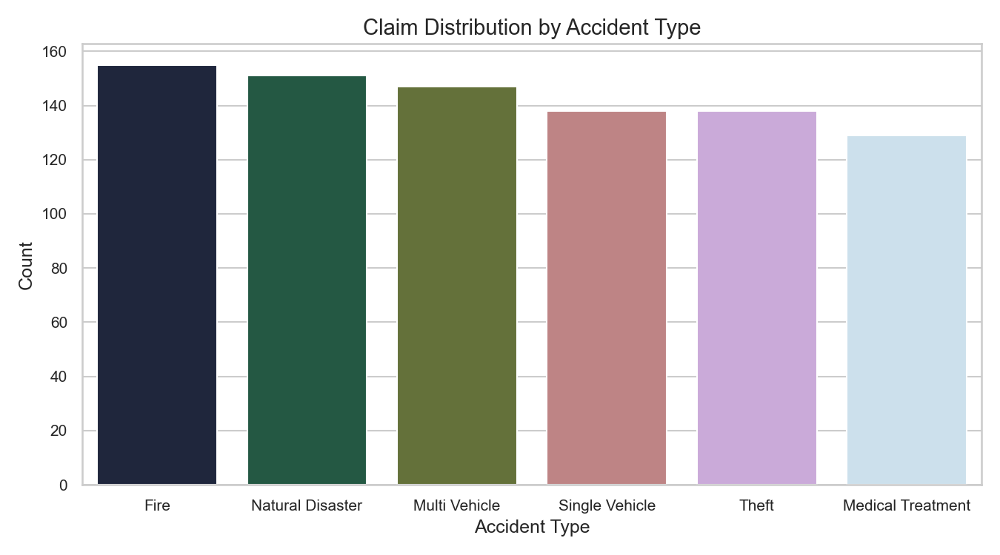
- **Insight**: "Single Vehicle" and "Multi Vehicle" collision claims represent the most common claim accident types, followed by "Theft" and "Medical Treatment". This helps target claims adjuster training.

### Chart 25: Distribution of Previous Claims
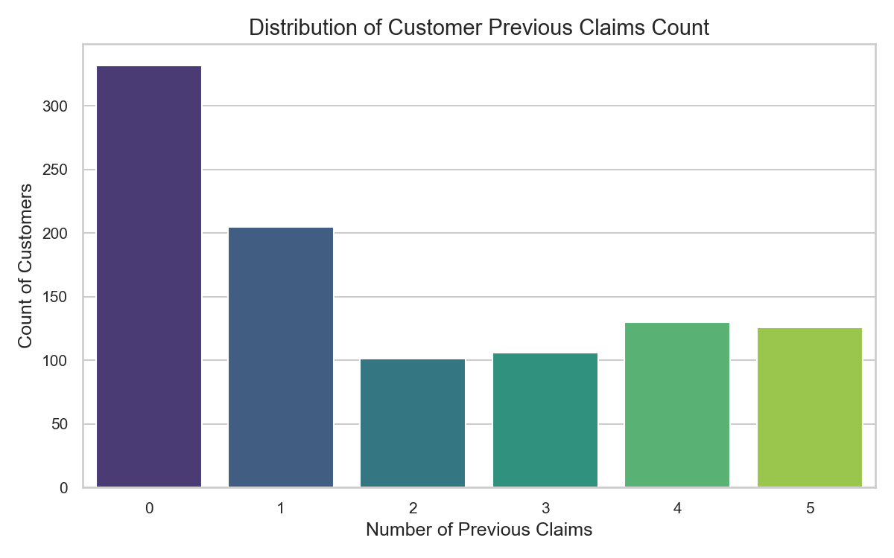
- **Insight**: Most policyholders have 0 or 1 previous claims. However, a small segment of "repeat claimants" has 3 to 5 previous claims. These repeat claimants represent a high-risk group that should be monitored for policy renewals.

### Chart 26: Correlation Heatmap
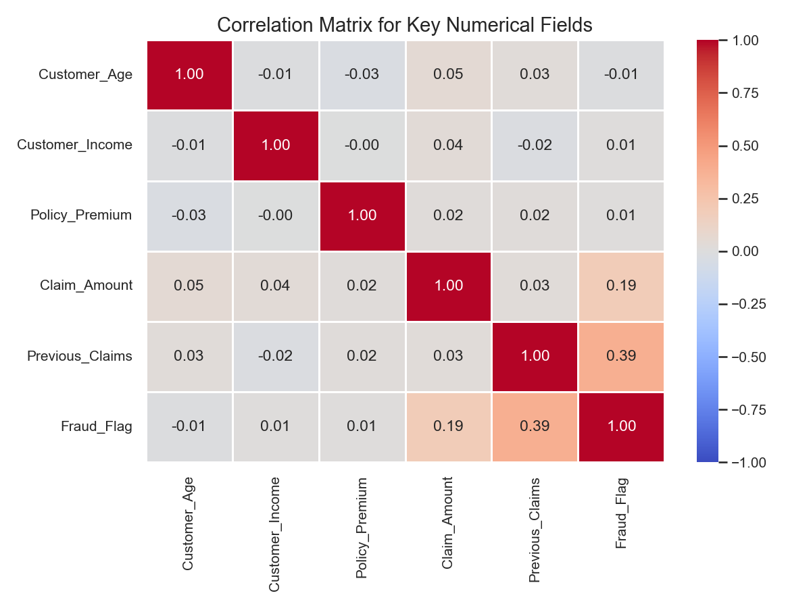
- **Insight**: The strongest correlation in the dataset is between `Claim_Amount` and `Fraud_Flag` (correlation coefficient ~0.35). This reinforces the finding that higher claim amounts are associated with a higher probability of fraud. Other variables (Age, Income, Premium) display weak linear correlations, highlighting the need for non-linear models (like tree-based models) to map complex interactions.
